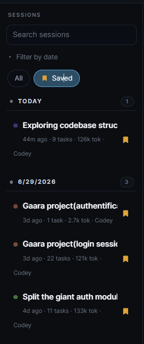
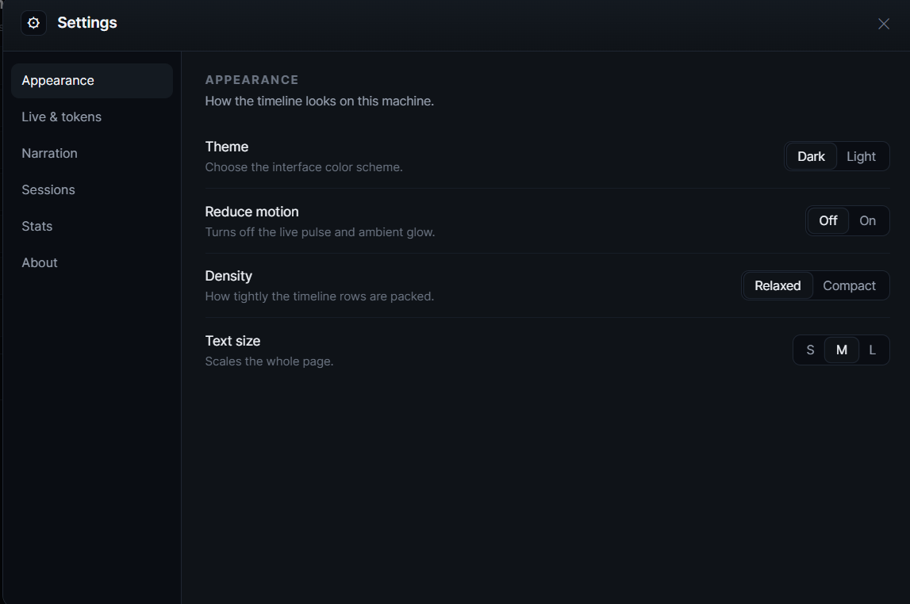
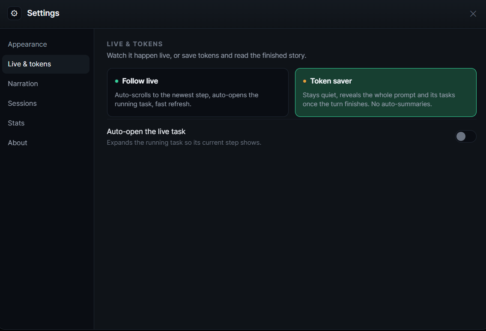
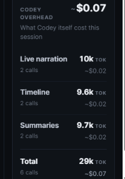

<div align="center">

# Codey

### Stores every Claude Code session, breaks down every step, and explains any of it whenever you want.

I made a plugin for Claude Code that stores all your previous sessions and lays them out as a timeline, with a breakdown of every step Claude takes during a prompt and explanations whenever you want them. While you work it can also follow along and narrate what Claude is doing, live, right in your terminal.

</div>

<p align="center">
  
</p>

<p align="center"><a href="SCREENSHOTS.md"><b>See more screenshots</b></a></p>

## What it does

When you give Claude a task, it fires off a wall of lines: tool calls, edits, commands, all scrolling past faster than you can read them. It gets hard to actually follow what Claude is doing.

Codey is my fix for that. It breaks down every step Claude takes, live, so you can follow the run as it happens instead of squinting at the raw output. And whenever a step makes you curious, you can ask for an explanation of it, only when you want one, so you stay cheap by default and dig in exactly where it matters.

## Install

Codey is a Claude Code plugin. From any Claude Code session, add the marketplace:

```
/plugin marketplace add SeanPash/Codey
```

Then install it:

```
/plugin install codey@codey
```

Restart your session so the hooks load, and you're set. It ships prebuilt, so there's no build step, and it uses the Claude Code login you already have. No API keys, no accounts, no setup.

From there, pick how you want to follow along:

- Run `/codey:timeline` for the timeline in your browser, where you can break down every step Claude took.
- Run `/codey:deep` (or another mode) to narrate the session right in your terminal as Claude works.

## The timeline

`/codey:timeline` opens a local browser page that lays out the whole session as a storyboard. The run shows up as a sequence of readable steps grouped by the prompt that kicked them off, with failures and warnings flagged right where they happened. A live strip at the top shows what Claude is doing this very moment, and Follow Live keeps the page pinned to the latest step so the browser stays in sync with your terminal.

The best part in my opinion: the timeline runs in the background for every session for practically no tokens, and you can reopen any session later and replay it step by step. So even if you never turn on narration, you still get the full story of every run to look back on.

<p align="center">
  
</p>

Session stats give you the shape of a run at a glance, and a token-breakdown chart shows exactly where your tokens went, split across reading, writing, searching, running commands, and thinking, with the priciest task called out. When a step makes you curious, there's an **Explain this step** button right on it, and you can recap a whole prompt the same way. You only spend a few tokens on the things you actually choose to dig into.

<p align="center">
  
</p>

## Saved sessions

The timeline isn't just for the run happening right now. A sessions sidebar lists every recent session grouped by day, so you can flip back to any of them and replay it step by step long after it finished. Search across them by name, filter by date, and star the ones worth keeping so a tap on **Saved** brings back just those.

<p align="center">
  
</p>

## Three modes: simple, deep, teach

Codey comes with three modes, and they're really one knob: how much you want to understand versus how many tokens you want to spend. Each one gives you a different depth of breakdown on the exact step Claude is doing, both in the terminal narration and on the timeline recaps.

- **simple** keeps it to one calm line and costs almost nothing.
- **deep** adds the why behind each step.
- **teach** explains the work and the ideas behind it, so you learn as you read.

Flip the depth toggle on the timeline and every recap rewrites itself to match, from a single honest line to a full teardown with the concept behind it. Here's the same session at each depth.

<p align="center">
  
  <br><em>Simple</em>
</p>

<p align="center">
  
  <br><em>Deep</em>
</p>

<p align="center">
  
  <br><em>Teach</em>
</p>

## Rich or Budget detail

There's a second knob that sits next to every explanation and summary: **Detail**, set to either **Rich** or **Budget**. Where the mode decides how a recap is shaped, Detail decides how much goes into it. **Rich** grounds each explanation in the actual edits and searches Claude ran, so it names the real change instead of talking in general terms, and it spends a bit more to do that. **Budget** keeps things leaner and cheaper. Rich is the default, and you can flip it from the header or right where you click to generate, so the tradeoff is in front of you at the moment you're about to spend. Token Saver quietly drops to Budget for you.

## Live narration in your terminal

If you turn on a mode, the bottom of your terminal becomes a two-line readout: the current step on top, the plain-English reason for it underneath. It updates as Claude works, so a glance tells you whether things are on track, and when a turn ends it settles into a short recap and points you at the full timeline. At the lightest setting it costs almost nothing, and you choose how much it says.

<p align="center">
  
</p>

## Every terminal in one place

If you run Claude Code in two or three terminals at once, it's easy to lose track of which window is doing what. The Active Terminals view puts them side by side, each open session with its own live timeline following along in real time, so you can see the exact position of every run at the same moment without tabbing between windows.

<p align="center">
  
</p>

## Knows when Claude is stuck

Some of the most useful stuff Codey does is completely free. Plain, AI-free detectors watch the live run and flag trouble the moment it shows up: **looping** on the same input, **repeating** the same error, or **hanging** far past a reasonable time.

When something fires, the stuck task gets an amber bar with three choices: nudge it to move on, push it toward a different approach, or stop and hand control back to you. One click feeds Claude a short reason it reads and acts on. Codey only ever observes and suggests, and never acts without your click.

<p align="center">
  
</p>

## Settings and Token Saver

There's a settings panel behind the gear in the top corner for tuning how the timeline looks and behaves, all saved on your machine.

**Appearance** covers the basics: dark or light theme, reduce motion to kill the live pulse and glow, relaxed or compact density, and a text-size scale for the whole page.

<p align="center">
  
</p>

**Live and tokens** is where **Token Saver** lives, and it's worth calling out. Follow Live auto-scrolls to the newest step and refreshes fast, which is great to watch but does a bit more work. Token Saver flips that around: it stays quiet, holds off on auto-summaries, and reveals the whole prompt and its steps once the turn finishes. So you still get the full breakdown, just for fewer tokens, read after the fact instead of live.

<p align="center">
  
</p>

There are more panels for narration, sessions, and stats too, so you can dial in exactly how much Codey shows and spends.

## What it costs

I tried to be honest about tokens, because that's the whole point. Part of Codey is genuinely free, and the rest is cheap, throttled to the mode you picked, and always added up in plain sight.

**Free:**

- **Reading the timeline.** The page reads a local log of what already happened, so scrolling any session, past or live, makes no model calls.
- **Stuck detection.** The loop, repeat-error, and hang checks are plain code with no model behind them.

**What you pay for, while you follow along:**

- **Live narration**, whenever a mode is on. It runs on the cheapest model in short throttled bursts. `simple` is near-zero, while `deep` and `teach` spend a little more to explain the why.
- **On-demand explanations.** Clicking Explain this step, or recapping a whole prompt, only spends on the step you chose.

Codey keeps its own tab, split across narration, timeline, and summaries, so you always see exactly what it added on top of your session. It all runs on the Claude plan you already have.

<p align="center">
  
</p>

## Your machine, and only your machine

Codey runs entirely on your computer. No API keys to paste, no account to create, nothing it phones home to. The narration is powered by your own Claude Code running quietly in the background on the login you already have. Events are written to local files and go nowhere else. Your code, your prompts, and your projects stay with you.

## Commands

Type `/codey` in Claude Code and the picker lists everything.

| Command | What it does |
| --- | --- |
| `/codey:simple` | Narration on, one calm line, near-zero tokens. |
| `/codey:deep` | Narration on, plus the why behind each step. |
| `/codey:teach` | Narration on, plus it teaches the concepts as Claude works. |
| `/codey:timeline` | Opens the browser storyboard for the session. |
| `/codey:off` | Stops narrating and restores your plain status line. |

## What's next

Codey is young and I'm still moving on it fast. A few things on the roadmap:

- **Codex support**, so the timeline and narration work no matter which agent you run.
- **Better budget controls**, with per-session caps you set up front so the deeper modes stay predictable.
- **A sharper timeline**: faster, cleaner, and easier to scan.
- **Smarter narration** that says more in fewer tokens.

## Feedback and bugs

I'd really appreciate anyone giving it a try and letting me know what to improve or anything that breaks. Open an issue on the [GitHub issue tracker](https://github.com/SeanPash/Codey/issues) with a quick note on what you were doing, what you expected, and what actually happened. Codey is new, so reports genuinely help.

And if you find it useful, a star on the repo would mean a lot and helps more people find it. Ty!

## Working on Codey

Want to change how Codey works or send a fix? Clone the repo, install the dependencies, and build it:

```bash
git clone https://github.com/SeanPash/Codey.git
cd Codey
npm install
npm run build
```

The hooks run the compiled output in `dist/`, so the build needs to succeed before your first session.

## Requirements

- Node.js 20 or newer.
- An active Claude Code install and login.

## License

MIT.
