<div align="center">

# Codey

### See what Claude is doing, and why.

Codey is a plugin for Claude Code that displays Claude's actions in a story-like manner: a timeline of sorts that lets you break down every task Claude did, live, and actually understand it. And while you work, it can follow along with what Claude is doing and narrate its actions live, in varying modes.

</div>

<p align="center">
  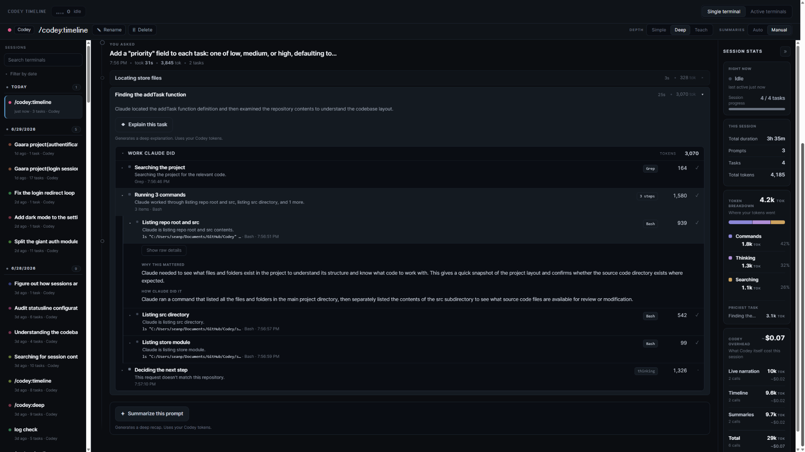
</p>

<p align="center"><a href="SCREENSHOTS.md"><b>See more screenshots</b></a></p>

## Install

Codey is a Claude Code plugin. From any Claude Code session, register the marketplace:

```
/plugin marketplace add SeanPash/Codey
```

Then install the plugin:

```
/plugin install codey@codey
```

Restart your session so the hooks load. Then pick how you want to follow along:

- Run `/codey:timeline` for a live timeline in your browser, where you can break down every task Claude did step by step.
- Run `/codey:deep` (or another mode) to narrate this session right in your terminal as Claude works.

Codey ships prebuilt, so there is no build step.

That's it. It uses the Claude Code login you already have. No API keys. No accounts. No setup.

## Why Codey?

You send Claude Code off on a task and the terminal goes quiet. Behind that silence it might fire thirty tool calls, and every one of them looks the same from the outside.

Is it making progress? Retrying the same dead end? Quietly burning tokens on the wrong file? You can't tell. So you either babysit a stream of raw logs you have to decode, or you walk away and hope it figured things out.

Codey closes that gap. It reads the tool-call stream Claude Code already produces and turns it into something you can follow at a glance, while you work, for almost nothing until you ask for more. You stop guessing and start watching.

## Features

### A timeline that tells the story

`/codey:timeline` opens a local browser page that lays out the whole session as a visual storyboard. The run unfolds as a sequence of readable steps grouped by the prompt that started them, with failures and warnings flagged right where they happened. A live strip at the top shows what Claude is doing this very moment, and Follow Live keeps the page pinned to the latest step, so the browser stays in sync with your terminal in real time.

Session stats give you the shape of the run at a glance, and a token-breakdown chart shows exactly where your tokens went, split across reading, writing, searching, running commands, and thinking, with the priciest task called out. When a step or a whole task makes you want to know more, there's an **Explain this step** button right on it, plus a way to recap an entire prompt. You spend a few tokens only on the things you choose to dig into.

<p align="center">
  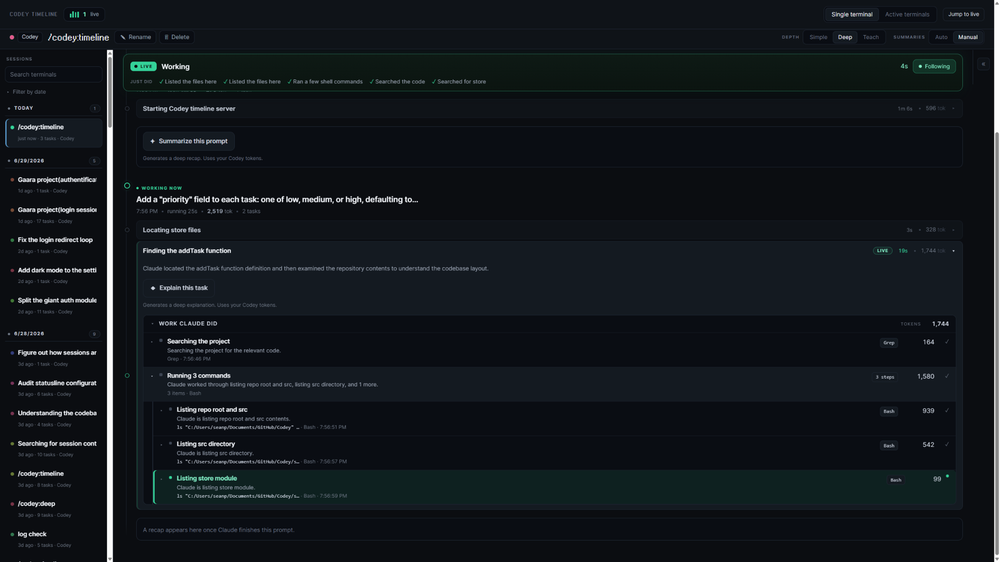
</p>

### Narration right in your terminal

While Codey is on, the bottom of your terminal becomes a two-line readout: the current step on top, the plain-English reason for it underneath. It updates as Claude works, so a glance tells you whether things are on track. When a turn ends, it settles into a short recap and points you at the full timeline.

At the lightest setting it costs almost nothing. You choose how much it says.

<p align="center">
  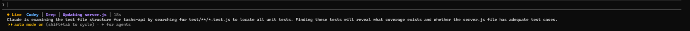
</p>

### Knows when Claude is stuck

Some of the most useful work Codey does is free. Pure, AI-free detectors watch the live run and flag trouble the moment it shows up: **looping** on the same input, **repeating** the same error, or **hanging** far past a reasonable time.

When something fires, the stuck task gets an amber bar with three choices: nudge it to move on, push it toward a different approach, or stop and hand control back to you. One click feeds Claude a short, plain reason it reads and acts on. Codey only ever observes and suggests. It never acts without your click.

<!-- SCREENSHOT NEEDED: the amber intervention bar on a stuck task with the three buttons (nudge / try a different approach / stop and ask me). Not yet captured, so this embed stays commented out until a shot exists. -->
<!-- 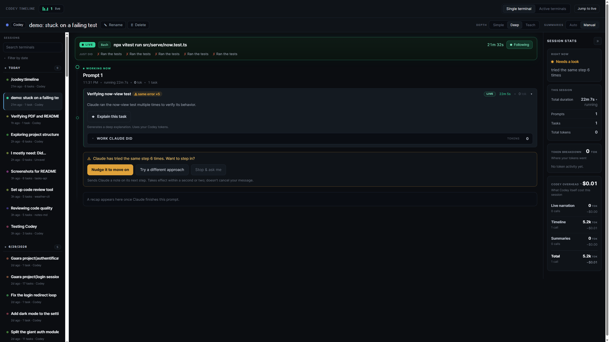 -->

### Explain any step, only when you want

The timeline is readable for free. When a step makes you curious, click **Explain this step** for a deeper, on-demand explanation of what happened and why. You spend a few tokens only on the steps you choose, so you stay cheap by default and dig in exactly where it matters. The same works for a whole prompt: ask for a recap of everything Claude got done that turn.

<p align="center">
  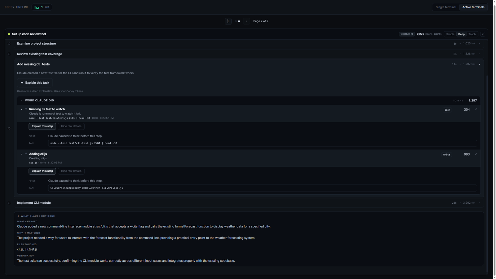
</p>

### Replay any session

The timeline isn't just for the run happening right now. A sessions sidebar lets you flip between every recent session and replay any of them step by step, so you can go back and understand a run long after it finished.

<p align="center">
  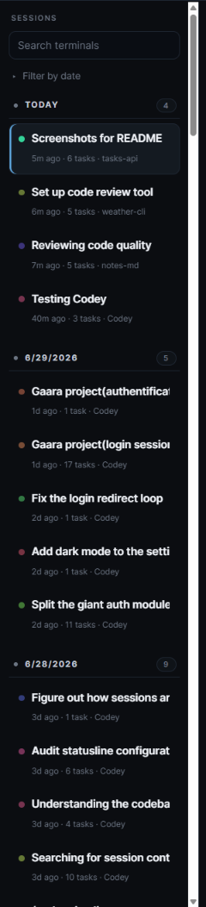
</p>

### Every terminal in one place

Running Claude Code in two or three terminals at once, it's easy to lose track of which window is doing what. The Active Terminals view puts them side by side. Each open session gets its own live timeline, following along in real time, so you can see the exact position of every run at the same moment without tabbing between windows and rebuilding the picture in your head.

It's the difference between juggling several silent terminals and watching all of them tell their story on one screen.

<p align="center">
  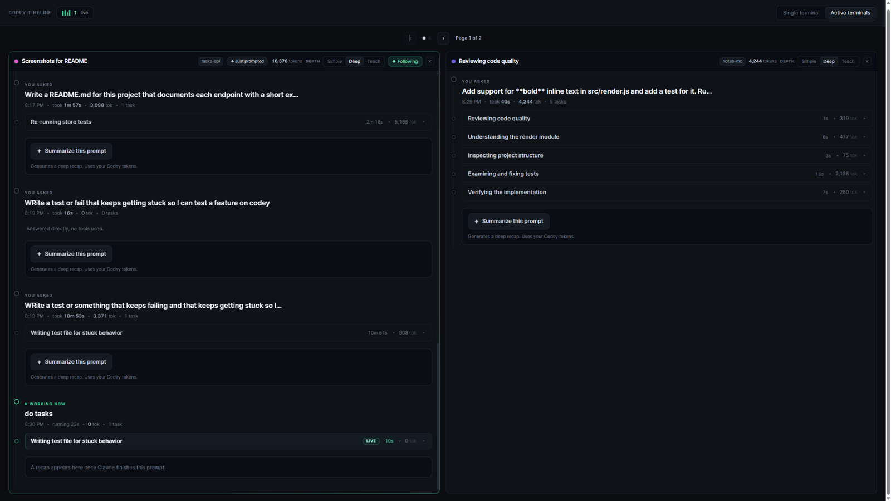
</p>

## Without Codey vs with Codey

| Without Codey | With Codey |
| --- | --- |
| Silent tool calls | Live narration |
| Raw logs | Visual timeline |
| Guess what Claude is doing | Read a story |
| Wonder if it's stuck | Automatic stuck detection |
| Dig through transcripts | Click any step for details |

## Perfect for

- Long Claude Code sessions
- Multi-agent workflows
- Learning how Claude solves problems
- Debugging agent behavior
- Understanding token usage
- Following autonomous coding sessions

## Token costs

Codey is built to stay cheap, and most of it costs nothing at all.

<table>
<tr>
<td valign="top">

- **The timeline is free.** It reads a local log of what already happened, so scrolling the full story of any session, including past ones, costs zero tokens. The stuck detectors are free too, since they are plain checks with no model behind them.
- **Narration runs on the cheapest model**, in short bursts throttled by mode. `simple` is near-zero, while `deep` and `teach` spend a little more to explain the why.
- **Explanations are on demand.** Clicking to explain a step, or recapping a whole task, is the only time the timeline spends anything, and only on the step you picked.

It all runs on the Claude plan you already have, so there is no separate bill to worry about.

</td>
<td valign="top" width="300">
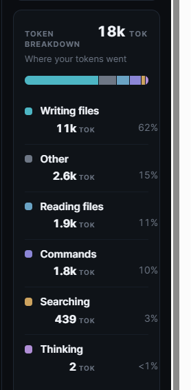
</td>
</tr>
</table>

## Your machine, and only your machine

Codey runs entirely on your computer. There are no API keys to paste, no account to create, and nothing it phones home to.

The narration is powered by your own Claude Code, running quietly in the background on the login you already have. Events are written to local files and go nowhere else. Your code, your prompts, and your projects stay with you.

## Commands

Type `/codey` in Claude Code and the picker lists everything.

| Command | What it does |
| --- | --- |
| `/codey:simple` | Narration on, one calm line, near-zero tokens. |
| `/codey:deep` | Narration on, plus the why behind each step. |
| `/codey:teach` | Narration on, plus it teaches the concepts as Claude works. |
| `/codey:timeline` | Opens the browser storyboard for the session. |
| `/codey:off` | Stops narrating and restores your plain status line. |

The three narration modes are really one knob: how many tokens you spend to understand more. `simple` is brief and nearly free, `deep` explains why each step matters, and `teach` explains the work and the ideas behind it. Narration runs on the cheapest model and draws on the same Claude plan as your normal work, so the deeper modes cost a little more of your quota. The timeline stays free either way, and only spends when you click for an explanation.

## The same run, summarized three ways

That one knob shows up on the timeline too. Flip the depth toggle and every recap rewrites itself to match, from a single honest line to a full teardown with the idea behind it. Here is the same session recapped at each depth.

### Simple

One honest line per prompt: what Claude got done, and nothing you have to wade through.

<p align="center">
  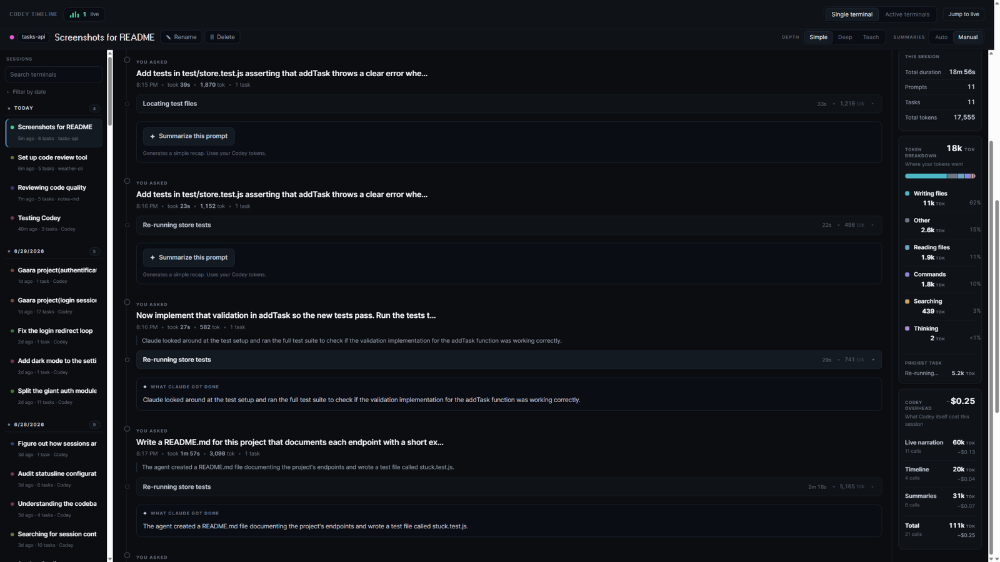
</p>

### Deep

The same recap, opened up: what changed, why it mattered, how it was verified, and what is still left.

<p align="center">
  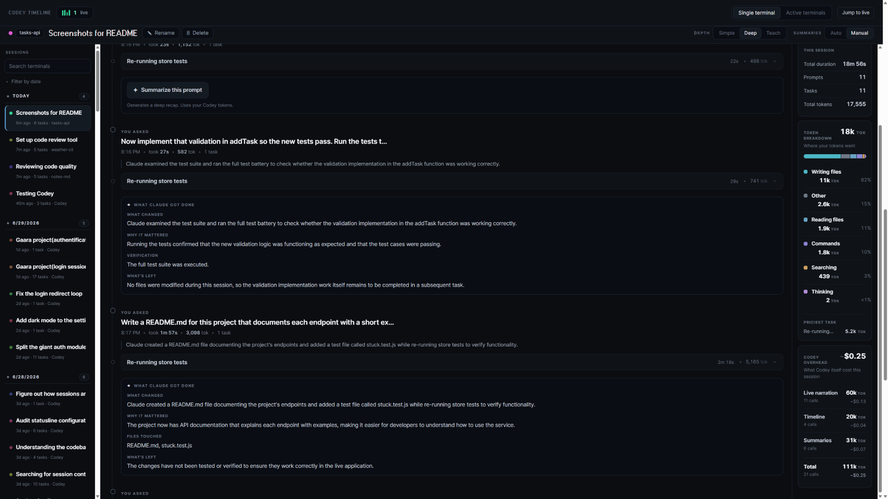
</p>

### Teach

Everything Deep shows, plus the files it touched and the concept behind the work, explained with a quick analogy so you learn as you read.

<p align="center">
  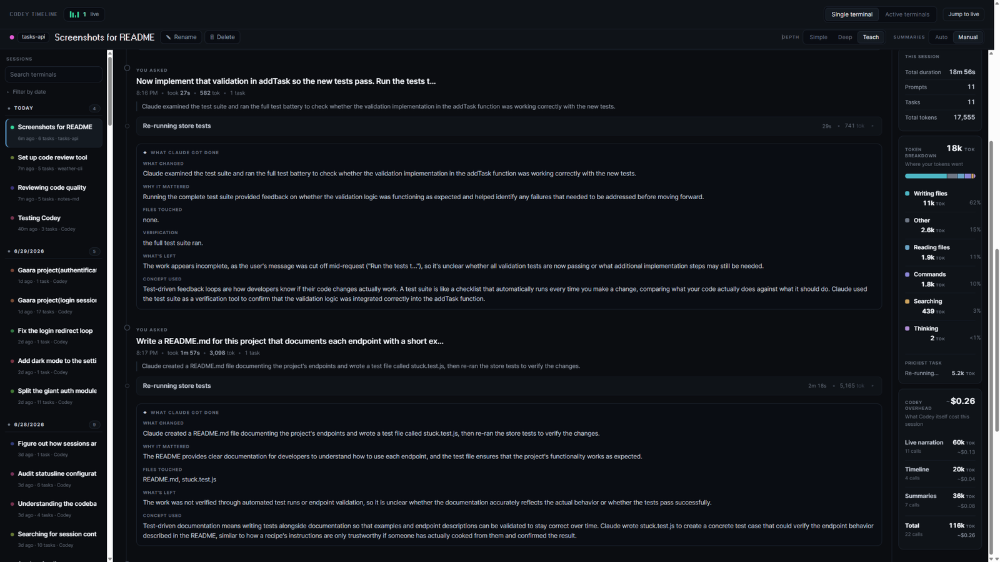
</p>

## What's next

Codey is young and moving fast. A few things on the roadmap:

- **Codex support.** Right now Codey reads the tool-call stream from Claude Code. The plan is to follow OpenAI's Codex CLI the same way, so the live timeline and narration work no matter which agent you run.
- **Better budget controls.** A tighter, clearer handle on what narration and explanations cost, with per-session caps you set up front, so the deeper modes stay predictable.
- **A sharper timeline.** More work on the browser UI: faster, cleaner, and easier to scan, with more of the run readable at a glance.
- **Smarter narration.** Tighter explanations that say more in fewer tokens, so `deep` and `teach` get richer without getting pricier.

Have something you want to see? Open an issue.

## Found a bug?

Open an issue on the [GitHub issue tracker](https://github.com/SeanPash/Codey/issues). A quick note on what you were doing, what you expected, and what actually happened goes a long way. Codey is new, so reports genuinely help.

## Working on Codey

Want to change how Codey works or send a fix? Clone the repo, install the dependencies, and build it, then add your local copy as a plugin:

```bash
git clone https://github.com/SeanPash/Codey.git
cd Codey
npm install
npm run build
```

The hooks run the compiled output in `dist/`, so the build needs to succeed before your first session.

## Requirements

- Node.js 20 or newer.
- An active Claude Code install and login.

## License

MIT.
