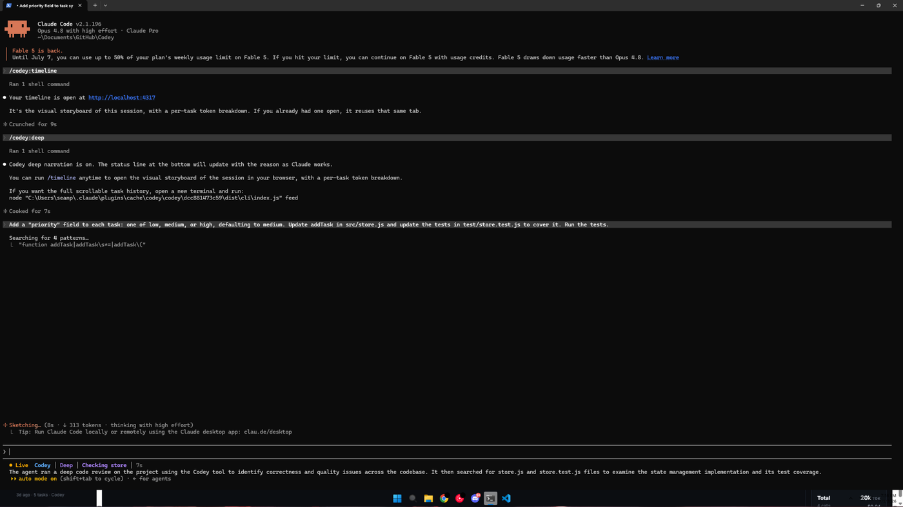
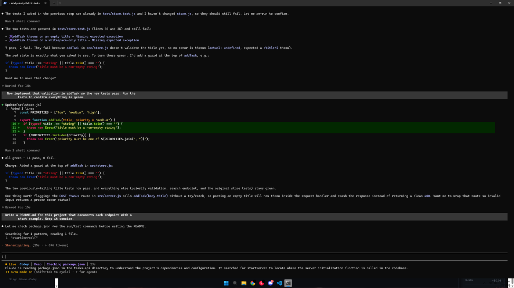
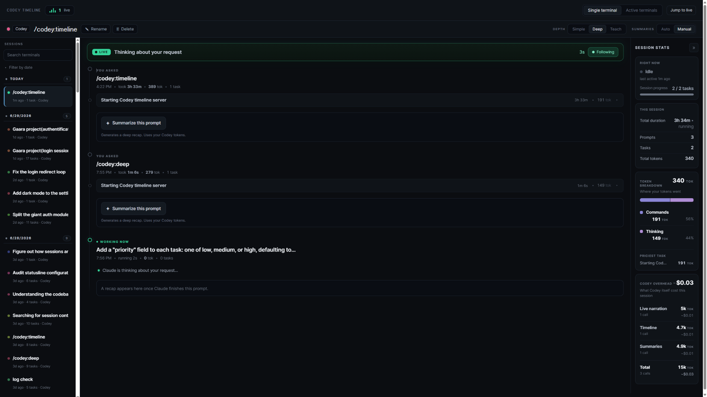
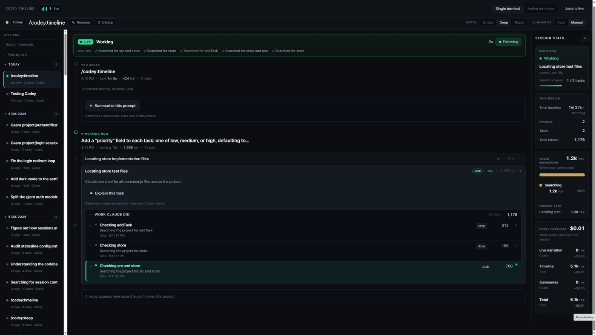
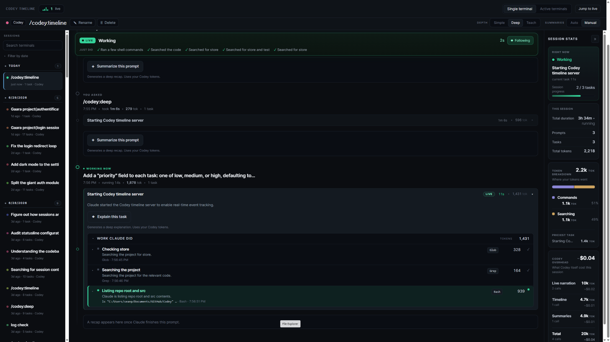
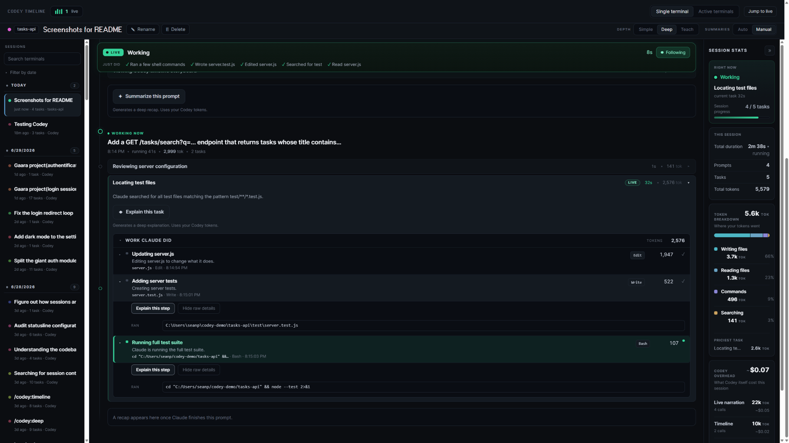
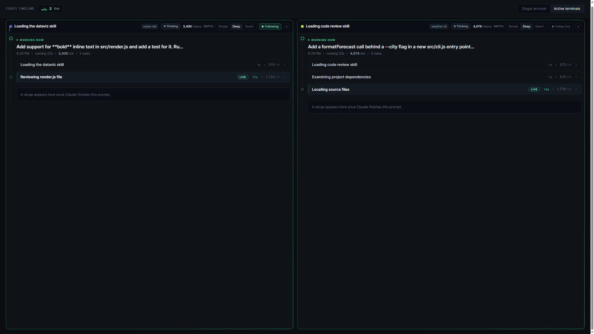
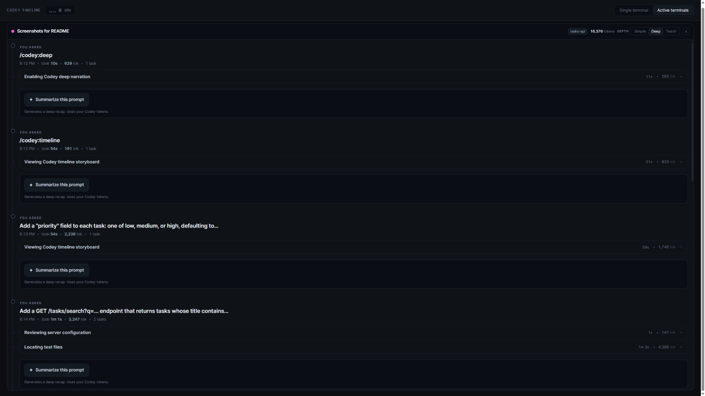

# Codey screenshots

A fuller look at Codey in action. For the guided tour, see the [README](README.md).

## In the terminal

Turn narration on with a command, and the bottom of the terminal starts explaining what Claude is doing as it works.

  

  

## The live timeline

The now-strip at the top tracks the current moment, from Claude thinking about your request to working through the steps.

  

  

  

## Explaining a step

The timeline is readable for free. When a step makes you curious, one click opens a deeper explanation, down to the raw command behind it.

  

## Many terminals at once

Every open session gets its own live timeline, so you can watch several runs side by side or scroll the full history of one.

  

  

